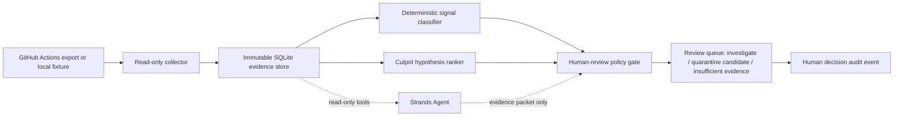

# Signal Steward architecture

Signal Steward is a read-only CI evidence steward. A scheduled collector or local replay supplies GitHub Actions-shaped events. The application normalizes them into immutable evidence, applies a deterministic signal policy, asks a Strands agent to inspect only those read-only tools, and presents a small human review queue.

For a Devpost-compatible upload, use the rendered [`architecture-diagram.png`](architecture-diagram.png); this Mermaid source remains the reviewable text version.

## Boundaries

| Component | Responsibility | Side effects |
| --- | --- | --- |
| Collector | Accept synthetic replay or a future read-only GitHub Actions adapter | None |
| Evidence store | Preserve attempt, SHA, log excerpt, and commit evidence hashes | Local SQLite write only |
| Classifier | Compute failure rate and same-SHA recovery; exclude cancelled/skipped outcomes | None |
| Hypothesis ranker | Rank candidate changes with supporting/contradicting evidence | None; never claims root cause |
| Strands agent | Orchestrate read-only inspection tools and concise evidence handoff | No external tools are registered |
| Policy gate | Decide whether a genuine human review item exists | None |
| Audit | Record approve/hold choice, rationale, and analyzed evidence hash | Append-only local event bound to the replay source |

The production integration should use a least-privilege GitHub App or token that can read workflow runs and repository metadata. The local default has no network path and uses `:memory:` storage. CI mutation, issue creation, test quarantine, PR creation, merge, and secret access are intentionally absent from the tool surface.
