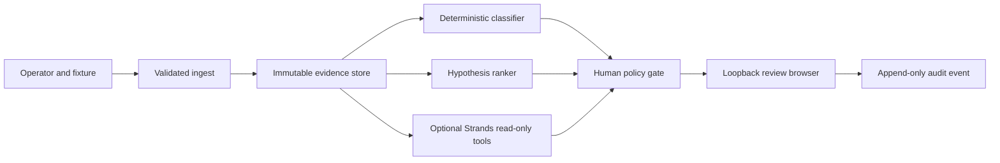

# Signal Steward threat model

## Executive summary

Signal Steward is a credential-free local CLI and loopback HTTP review desk. Its
highest risks are local integrity of the audit ledger, accidental ingestion of
sensitive log content, and future misuse of the optional model/provider path.
The loopback-only binding fix materially reduces network exposure, while the
current product has no remote GitHub integration, mutation tool, authentication
layer, or production deployment.

## Scope and assumptions

- In scope: `signal_steward/`, `static/index.html`, `fixtures/`, `tests/`,
  `benchmarks/`, `.github/workflows/test.yml`, and the local server/CLI entry
  points.
- Intended use: one operator runs a synthetic or public, non-sensitive replay
  on one machine and reviews a small queue in a browser.
- Deployment assumption: the server binds only to loopback; it is not an
  internet-facing service and has no authentication or TLS.
- Data assumption: fixtures and captured excerpts contain no secrets or PII;
  this is a process requirement, not an automatic redaction guarantee.
- Out of scope: a future authenticated GitHub collector, AWS deployment,
  AgentCore, Devpost, live model invocation, multi-tenancy, and repository
  mutation.
- Open questions: what production identity/authorization will protect a future
  collector; which log redaction policy is required; whether audit events need
  tamper evidence beyond local SQLite.

## System model

### Primary components

The CLI and `AppState` load a GitHub-Actions-shaped fixture, normalize it into
immutable evidence, classify outcomes, rank hypotheses, and build a review
queue. The local HTTP server serves a static browser and exposes `GET /health`,
`GET /api/report`, and `POST /api/decisions`. The optional Strands adapter
registers three read-only tools over the same store; the default local replay
does not invoke a provider.

### Data flows and trust boundaries

- Operator filesystem → ingest (`signal_steward/ingest.py:load_bundle`): JSON
  fixture bytes cross a local file boundary; JSON shape, required fields, enum
  conclusions, and a 4,000-character log-excerpt limit are checked. There is
  no authenticity or secret-redaction check.
- Ingest → evidence store (`signal_steward/service.py:analyze` and
  `signal_steward/store.py:write_bundle`): typed attempts/commits cross an
  in-process boundary; parameterized SQLite writes and SHA-256 evidence hashes
  detect a changed row for an existing key.
- Loopback browser → HTTP server (`signal_steward/server.py`): HTTP JSON crosses
  an unauthenticated, unencrypted loopback boundary. `create_server` rejects
  non-loopback hosts; POST bodies are limited to 16 KiB, JSON must be an object,
  decisions are limited by `record_human_decision` to `approve` or `hold`, and
  rationale is truncated to 2,000 characters.
- HTTP server → audit store (`signal_steward/server.py:AppState.record_decision`):
  an item ID, decision, rationale, and analyzed source hash become one
  append-only local SQLite event; no CI, tracker, repository, or cloud mutation
  is reachable.
- Evidence store → optional Strands Agent (`signal_steward/agent.py`): tool
  results cross an in-process/provider boundary when an operator explicitly
  builds or invokes the agent. The registered tools use read-only SELECTs or
  packet construction; provider authentication/configuration is external and
  not exercised by the default replay.

#### Diagram

## Assets and security objectives

| Asset | Why it matters | Security objective |
| --- | --- | --- |
| Job logs, SHAs, and changed-file evidence | May contain proprietary failure context and drives review recommendations | C/I |
| Review queue and hypothesis ranking | Influences an engineer’s next action | I |
| Audit events and rationales | Records who/what decision was made locally | I, A |
| AWS credentials/provider configuration | Could incur cost or expose cloud access if mishandled | C |
| Source code, fixtures, and benchmark results | Public reproducibility and trust depend on integrity | I, A |
| Loopback server resources | Excessive requests could make the local demo unavailable | A |

## Attacker model

### Capabilities

- A malicious local process or user who can connect to `127.0.0.1:8810`.
- An operator who supplies a crafted fixture, including misleading log and
  commit strings.
- An attacker who controls text in a future imported CI log or commit message
  and can cause an operator to pass it to the optional agent.
- A dependency or CI supply-chain compromise affecting installation/build time.

### Non-capabilities

- No remote network attacker can reach the default server through its enforced
  binding unless the operator changes the code or environment.
- No attacker can invoke a registered CI rerun, issue creation, quarantine,
  merge, workflow edit, or secret-reading tool because none exists.
- The current fixture-only build has no GitHub token, multi-tenant account,
  production database, or cloud deployment to attack.

## Entry points and attack surfaces

| Surface | How reached | Trust boundary | Notes | Evidence |
| --- | --- | --- | --- | --- |
| Fixture parser | CLI/server startup | Operator filesystem → app | 2 MiB total input cap, JSON parser, required fields, enum validation, excerpt truncation | `signal_steward/ingest.py:13-69` |
| Static browser | `GET /` | Loopback browser → server | Reads one repository-local HTML file | `signal_steward/server.py:70-87` |
| Report API | `GET /api/report` | Loopback browser → server | Returns evidence-derived report and audit events | `signal_steward/server.py:75-76` |
| Decision API | `POST /api/decisions` | Loopback browser → server/store | Bounded JSON; only approve/hold reaches the service | `signal_steward/server.py:89-109`, `service.py:54-61` |
| Strands tools | Optional Python/provider call | Store → agent | Three read-only tools; logs remain model-visible data | `signal_steward/agent.py:25-70` |
| CI install workflow | GitHub Actions | Public repo → CI runner | Read-only contents permission, dependency installation | `.github/workflows/test.yml:7-21` |

## Top abuse paths

1. Local attacker → connect to an exposed server → POST a valid review item and
   rationale → corrupt the local decision ledger.
2. Operator → ingest a fixture containing a secret → persist it in SQLite →
   return it through `/api/report` → expose it in the browser or artifact.
3. Crafted log/commit text → optional Strands tool returns it → provider treats
   instructions in that text as authority → produce a misleading review packet
   (without direct mutation).
4. Crafted fixture → create a very large run/job structure within parser limits
   per excerpt but not total document size → consume local memory/startup time →
   deny the demo.
5. Dependency or workflow compromise → alter installed code or test output →
   publish a misleading public result or tamper with the build.

## Threat model table

| Threat ID | Threat source | Prerequisites | Threat action | Impact | Impacted assets | Existing controls (evidence) | Gaps | Recommended mitigations | Detection ideas | Likelihood | Impact severity | Priority |
| --- | --- | --- | --- | --- | --- | --- | --- | --- | --- | --- | --- | --- |
| TM-001 | Local operator/process | Must reach a server socket | Bind or expose the audit API beyond the intended machine | Remote tampering of local audit decisions | Audit events, review integrity | `server.py:create_server` rejects non-loopback; workflow is local by default | No auth/TLS for same-host clients | Keep loopback enforcement; require an explicit separately reviewed production gateway for any remote mode | Log bind host and reject test; integration test for `0.0.0.0` | Low | Medium | low |
| TM-002 | Local user/process | Access to loopback port | POST `approve`/`hold` for a valid item or replay the endpoint | Ledger integrity loss; no external CI mutation | Audit events | Decision enum and item lookup; append-only insert bound to analyzed source hash; local-only scope | No caller identity, CSRF defense, or event signature | Treat audit as demo evidence only; add authn/authz and actor binding before shared use | Alert on unexpected local port/process; verify event count, IDs, and source hashes | Medium | Low | low |
| TM-003 | Malicious fixture/CI text | Operator imports untrusted or sensitive data | Poison logs/commit vocabulary or embed secrets | Misleading recommendation or local data exposure | Evidence, queue, logs | Typed parser, 2 MiB input cap, excerpt truncation, evidence hashes, no automatic action | No source authenticity, redaction, or content labeling | Add source attestation, redaction/secret scan, and explicit untrusted-text delimiters before live integration | Hash/source checks; scan fixtures; test malicious strings | Medium | Medium | medium |
| TM-004 | Crafted log/commit text | Optional provider invocation | Prompt-inject the agent through tool-returned evidence | Wrong explanation or human decision; no direct mutation | Queue integrity, human attention | System prompt says evidence-only/no causal certainty; tools have no mutators; invocation is optional | Model output is not cryptographically bound to evidence and is not adversarially evaluated | Treat model text as non-authoritative; require deterministic policy output and evidence citations; add injection fixtures | Compare model packet to deterministic report; flag unsupported claims | Low | Medium | low |
| TM-005 | Crafted oversized fixture/request | Local operator or client can send large input | Exhaust memory/startup or tie up the single-threaded server | Demo availability loss | Availability | Fixture bytes ≤2 MiB; POST body ≤16 KiB; log excerpt ≤4,000 chars; no remote listener | Run/job/list counts and GET response are not bounded | Add run/job and response-size caps before untrusted input | Resource/time budget test; reject oversized fixtures with clear errors | Low | Medium | low |
| TM-006 | Dependency/CI supply chain | Installer or upstream package compromise | Alter runtime or benchmark output | Public build/research integrity | Source/build artifacts/results | Strands pinned to 1.53.0; GitHub job has `contents: read`; tests run in CI | pytest range and pip bootstrap are not hash-locked; no dependency lockfile | Add lock/hash verification and dependency update review before production use | Dependabot/lock diff review; compare benchmark fixture hash | Low | High | medium |

## Criticality calibration

- **Critical:** remote code execution, cloud credential exposure, or an
  unauthenticated mutation path affecting a real repository. None is present in
  the local slice.
- **High:** secret leakage or integrity compromise that could cause a real CI,
  tracker, or merge action. The current tool surface intentionally lacks those
  actions; TM-003 becomes high if live sensitive logs are enabled.
- **Medium:** persistent poisoning of evidence, model-induced false guidance,
  or build compromise. TM-003 and TM-006 are medium under the current
  assumptions.
- **Low:** local audit tampering or demo denial with no external side effect.
  TM-001, TM-002, TM-004, and TM-005 remain low after existing controls.

## Focus paths for security review

| Path | Why it matters | Related Threat IDs |
| --- | --- | --- |
| `signal_steward/server.py` | Loopback binding, request parsing, and audit write boundary | TM-001, TM-002, TM-005 |
| `signal_steward/ingest.py` | Untrusted fixture parsing, truncation, and missing total-size limits | TM-003, TM-005 |
| `signal_steward/agent.py` | Evidence text enters an optional model/provider boundary | TM-003, TM-004 |
| `signal_steward/store.py` | Evidence immutability and audit integrity | TM-002, TM-003 |
| `pyproject.toml` | Dependency and package surface | TM-006 |
| `.github/workflows/test.yml` | Build permissions and dependency installation | TM-006 |

## Notes on use

This is a bounded local/demo threat model. It records the actual trust and
side-effect boundaries in the public tree; it is not a production authorization
design. Re-run it before enabling remote GitHub ingestion, loading sensitive
logs, invoking a paid model provider, or exposing the server beyond loopback.
